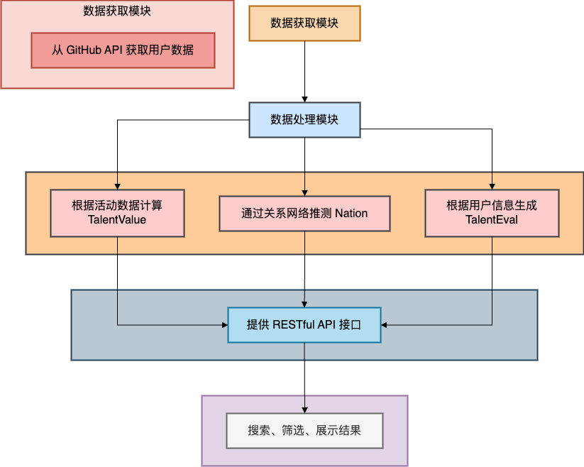

# 项目架构设计文档

## 项目概述

**项目名称**：GitHub 开发者技术能力评估系统  
**项目目标**：从 GitHub 获取开发者信息，计算其技术评分（TalentValue）并推测其所属国家（Nation），生成开发者的评估报告。前端展示开发者列表和详情，支持按 Nation 等筛选排序。

## 模块规格


### 数据获取模块
- **功能**：从 GitHub API 获取开发者的用户信息、仓库详情及关系网络数据（followers、followings）。
- **实现**：使用 Octokit 与 GitHub API 交互，抓取 `user_info_list` 作为数据处理输入。
- **输入**：GitHub 用户名、仓库名等。
- **输出**：JSON 格式的用户信息、仓库详情及关系网络数据。
- **核心逻辑**：调用 GitHub API 端点获取数据，并处理异常情况（如请求失败、API 限流等）。

### 数据处理模块
- **功能**：计算每位开发者的 `TalentValue`，识别其技术领域，并根据关系网络推测 Nation。
- **输入**：从数据获取模块获取的用户信息、仓库详情及关系网络数据。
- **输出**：开发者的 `TalentValue` 和推测的 `Nation`。
- **核心逻辑**：
  - **TalentValue 计算**：
    - 根据用户在 GitHub 上的活动数据（如 PR、Issue、Star 等）计算项目的重要度和贡献度。
    - 计算公式：
       $\text{TalentValue} = \text{FollowersValue} + \text{RepoImportanceValue} + \text{RepoContributionValue}$
    - 各项指标的权重和计算公式：
      - **FollowersValue**：
         $\text{FollowersValue} = w_{\text{followers}} \times \text{followers}$
        -  $w_{\text{followers}} = 0.6$
      - **RepoImportanceValue**：
         $\text{RepoImportanceValue} = w_{\text{publicRepoSum}} \times \text{publicRepoSum} + w_{\text{stars}} \times \text{stars} + w_{\text{forks}} \times \text{forks} + w_{\text{watches}} \times \text{watches}$
        -  $w_{\text{publicRepoSum}} = 0.4$
        -  $w_{\text{stars}} = 0.6$
        -  $w_{\text{forks}} = 0.7$
        -  $w_{\text{watches}} = 0.5$
      - **RepoContributionValue**：
         $\text{RepoContributionValue} = w_{\text{prs}} \times \text{prs} + w_{\text{closedPrs}} \times \text{closedPrs} + w_{\text{mergedPrs}} \times \text{mergedPrs}$
        -  $w_{\text{prs}} = 0.2$
        -  $w_{\text{closedPrs}} = 0.1$
        -  $w_{\text{mergedPrs}} = 0.4$
  - **Nation 推测**：
    - 从关系网络收集 `Location` 的具体步骤：
      1. 获取用户的关注者和关注中用户。
      2. 获取关注者和关注中用户的位置信息。
      3. 过滤有效的位置信息。
      4. 根据有效的位置信息，使用 OpenAI API 推测国家。
    - 置信度计算：
       $\text{Confidence} = \frac{\text{MaxCount}}{\text{TotalValid}}$
    - 阈值设置：设定置信度阈值（例如 0.3），如果置信度大于或等于阈值，则返回出现次数最多的国家，否则返回 `'N/A'`。

### 生成用户技术评估模块
- **功能**：生成用户的技术能力评估报告。
- **输入**：GitHub 用户名、TalentValue。
- **输出**：用户的技术能力评估报告。
- **核心逻辑**：
  - **数据提取**：
    - 提取用户的非 fork 仓库列表、个人简介、博客 URL、仓库 README 信息和编程语言信息。
  - **报告生成**：
    - 使用 OpenAI API 根据提取的数据生成技术能力评估报告。
    - 报告内容包括个人信息、技术评分、主要贡献与项目评估、综合技术能力评估。
  
### Nation 推测模块

**功能**：
- 根据用户的位置信息和关系网络推测用户所属国家（Nation）。

**输入/输出**：
- **输入**：用户的位置信息、关注者和关注中用户的数据。
- **输出**：推测的国家名称（Nation）及其置信度。

**核心逻辑**：

1. **位置验证**：
   - 使用正则表达式验证位置字符串的有效性。

2. **位置到国家的转换**：
   - 使用 OpenAI API 将位置字符串转换为国家名称。

3. **批量位置到国家的转换**：
   - 将位置字符串数组转换为国家名称数组。
  
4. **置信度计算**：
   - 计算每个国家的出现频率，并计算置信度。

5. **获取国家名称**：
   - 从用户的位置信息和关系网络中获取国家名称，并计算置信度。

6. **延迟执行**：
   - 处理速率限制时的延迟执行。
  
### API 模块
- **功能**：提供 RESTful API 接口，供前端调用以获取开发者评估数据。
- **输入**：前端的请求参数（如搜索关键词、筛选条件等）。
- **输出**：JSON 格式的开发者评估数据。
- **核心逻辑**：
  - **用户搜索 API**：
    - 请求方法：`GET`
    - 请求参数：`q`（搜索关键词）、`page`（页码）、`per_page`（每页结果数量）
    - 响应数据格式：
      ```json
      {
        "total_count": 100,
        "users_info_list": [
          {
            "id": 1,
            "login_name": "octocat",
            "avatar_url": "https://github.com/images/error/octocat_happy.gif",
            "html_url": "https://github.com/octocat",
            "followers": 20,
            "public_repos": 10,
            "location": "San Francisco",
            "email": "octocat@github.com",
            "bio": "A mysterious octocat",
            "blog": "https://github.blog",
            "talent_value": 85
          }
        ]
      }
      ```
  - **用户技术评估 API**：
    - 请求方法：`POST`
    - 请求参数：username（GitHub 用户名）
    - 响应数据格式：
      ```json
      {
        "evaluation_report": "..."
      }
      ```

### 前端模块
- **功能**：展示开发者列表、详情页和筛选功能。
- **输入**：用户的搜索关键词、筛选条件等。
- **输出**：开发者列表和详情页。
- **核心逻辑**：
  - **搜索和筛选**：根据用户名搜索，按 Nation、TalentValue 排序。
  - **评估展示**：分页显示开发者评估列表、TalentValue 评分及详情页。

## 模块分工

- 张洛（组长）

    - 搭建前端（React.js）与后端（Express.js）框架，确定项目结构。
    - TalentValue 计算（项目贡献度部分）及开发者 Nation 推测模块。
    - 编写前端页面的开发者用户名搜索与筛选功能，实现开发者评估列表和详情展示。

- 陈非池

    - 根据开发者的关系网络推测 Nation 及置信度。
    - 用户技术能力评估：对用户 Profile 和仓库数据进行评估，生成规范化的评估报告。
    - 优化项目逻辑、推荐并发请求方式、管理项目文档（Notion）。
